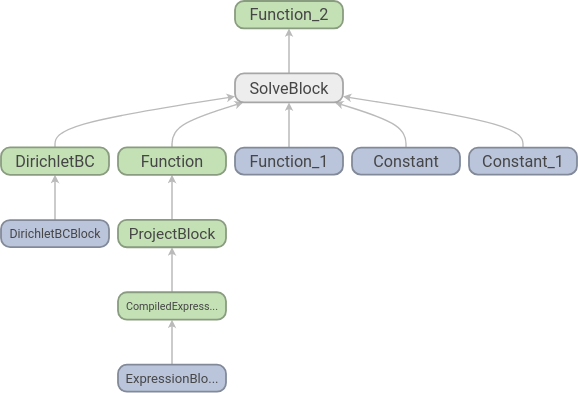
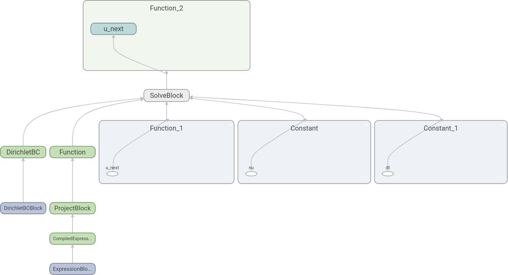
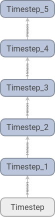
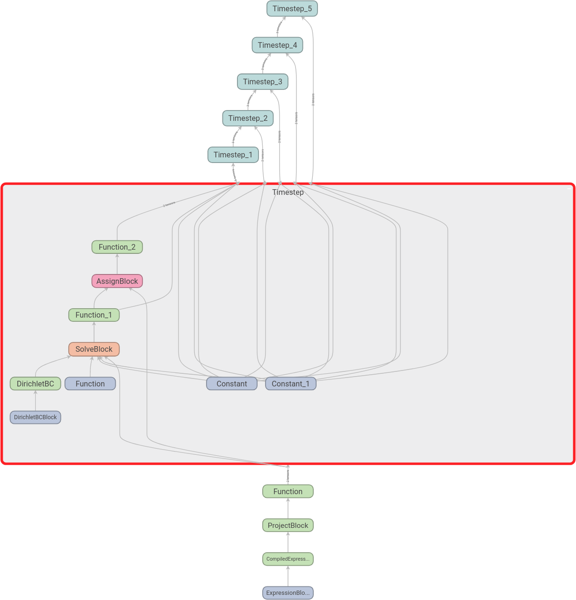

.. py:currentmodule:: dolfin_adjoint

=========
Debugging
=========

*******************************************
Visualising the system
*******************************************

It is sometimes useful when debugging a problem to see dolfin-adjoint's
interpretation of your forward system, and the other models it derives
from that. The :py:meth:`visualise <pyadjoint.Tape.visualise>` function
visualises the system as a graph using `TensorFlow
<https://www.tensorflow.org/>`_. To do this add

.. code-block:: python

    tape = get_working_tape()
    tape.visualise()

This will create a log directory with TensorFlow event files. We can
then run TensorBoard, which comes bundled with TensorFlow, and point it
to this log directory:

.. code-block:: console

    tensorboard --logdir=log

By default the log directory is a directory :py:data:`log` in the
current working directory. This can be changed by specifying a
directory in the :py:data:`logdir` keyword argument to
:py:meth:`visualise <pyadjoint.Tape.visualise>`.

Finally, we can open http://localhost:6006/ in a web browser to view the
graph. To demonstrate, let us use a simplified version of our old
Burgers' equation example:

.. literalinclude:: ../_static/tutorial7.py

Here we solve the equation for only one timestep.

|more| Download the `code to find graph`_.

.. _code to find graph: ../_static/tutorial7.py

Running TensorBoard and opening http://localhost:6006/ in our web
browser shows us the following graph:

Each node corresponds to an elementary operation, and we see that the
structure is what we should expect: two functions, two constants and a
set of boundary conditions go into an equation and we get one function
out. To increase readability further we can add names to the functions:

.. literalinclude:: ../_static/tutorial7_named.py

The resulting graph is the following:

Here we have expanded some of the nodes by double-clicking on them. We
see that it is indeed :py:data:`u_next` that is found by the equation
solve.

|more| Download the `code to find the graph with names`_.

.. _code to find the graph with names: ../_static/tutorial7_named.py

If we have a time loop, the graph can easily become large and difficult
to read. The :py:meth:`name_scope <pyadjoint.Tape.name_scope>` factory
function can be used to make this easier. To demonstrate this, we add a
time loop to our example above:

.. literalinclude:: ../_static/tutorial7_name_scope.py

Here, we should note the line after we enter the :py:data:`while`
loop. In this line we use a :py:data:`with` statement together with
:py:meth:`name_scope <pyadjoint.Tape.name_scope>` and a name for the
scope. This will ensure that all nodes corresponding to one time step
will be added to its own scope. After the time loop, we call
:py:meth:`visualise <pyadjoint.Tape.visualise>` and get the following
graph:

We can then expand the scopes as we like. Here we have expanded the
first time step:

|more| Download the `code to find the graph with name scopes`_.

.. _code to find the graph with name scopes: ../_static/tutorial7_name_scope.py

In the :doc:`next section
<parallel>` we discuss parallelisation.

.. |more| image:: ../_static/more.png
          :align: middle
          :alt: more info
