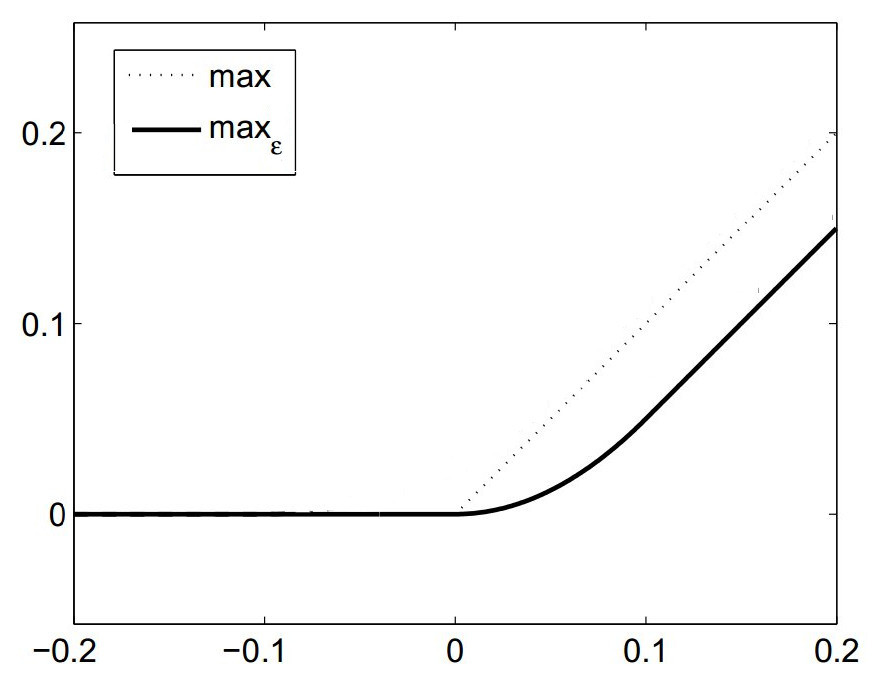
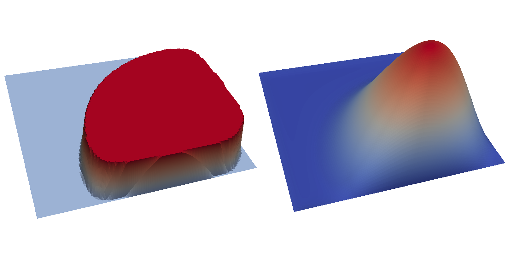

..  #!/usr/bin/env python
  # -*- coding: utf-8 -*-
  
.. py:currentmodule:: dolfin_adjoint

Mathematical Programs with Equilibrium Constraints
==================================================

.. sectionauthor:: Simon W. Funke <simon@simula.no>

This demo solves example 5.2 of :cite:`hintermueller2011`.

Problem definition
******************

This problem is to minimise

.. math::
      \min_{y, u} \frac{1}{2} || y - y_d ||^2_{\Omega} + \frac{\nu}{2} || u ||^2_{\Omega}

subject to the variational inequality

.. math::
      ( \nabla y, \nabla (v - y) )_\Omega &\ge (f + u, v - y)_\Omega \qquad \forall v \ge 0, v = 0 \ \mathrm{on}\ \delta \Omega, \\
      y &\ge 0, \\
      y &= 0 \quad \mathrm{on}\ \delta \Omega,

and control constraints

.. math::
         a \le u \le b \qquad \forall x \in \Omega,

where :math:`u` is the control, :math:`y` is the solution of the
variational inequality, :math:`y_d` is data to be matched, :math:`f`
is a prescribed source term, :math:`\nu` is a regularisation
parameter and :math:`a, b` are upper and lower bounds for the
control.

This problem is fundamentally different to a PDE-constrained
optimisation problem in that the constraint is not a PDE, but a
variational inequality.  Such problems are called Mathematical
Programs with Equilibrium Constraints (MPECs) and have applications
in engineering design (e.g. to determine optimal trajectories for
robots :cite:`yunt2005` or process optimisation in chemical
engineering :cite:`baumrucker2008`) and in economics (e.g. in
leader-follower games :cite:`leyffer2005` and optimal pricing
:cite:`lawphongpanich2004`).

Even though it is known that the above problem admits a unique
solution, there are some difficulties to be considered when solving
MPECs:

 - the set of feasible points is in general not necessarly convex or connected, and
 - the reduced problem is not Fréchet-differentiable.

Following :cite:`hintermueller2011`, we will overcome these issues
in the next section with a penalisation approach.  For a more
thorough discussion on MPECs, see :cite:`luo1996` and the references
therein.

Penalisation technique
**********************

A common approach for solving variational inequalities is to
approximate them by a sequence of nonlinear PDEs with a penalisation
term.  We transform the above problem into a sequence of
PDE-constrained optimisation problems, which can be solved with
``dolfin-adjoint``.

For the above problem we use the approximation

.. math::
      (\nabla y, \nabla v)_\Omega + \frac{1}{\alpha} (\pi(y), v)_\Omega = (f + u, v)_\Omega \qquad \forall v, \\

where :math:`\alpha > 0` is the penalty parameter and the penalty term
is defined as

.. math::
      \pi(y) = -\max(0, y).

This approximation yields solutions which converge to the solution of
the variational inequality as :math:`\alpha \to 0` (see chapter IV of
:cite:`kinderlehrer2000`).

In order to be able to apply a gradient-based optimisation method, we
need differentiabilty of the above equation.  The :math:`\max`
operator is not differentiable at the origin, and hence it is replaced
by a smooth (:math:`C^1`) approximation (plot modified from
:cite:`hintermueller2011`):

.. math::
      {\max}_{\epsilon}(0, y) =
      \begin{cases}
      y - \frac{\epsilon}{2} & \mbox{if } y \ge \epsilon, \\
                    \frac{y^2}{2\epsilon}  & \mbox{if } y \in (0, \epsilon), \\
                    0                  & \mbox{if } y \le 0.
      \end{cases}

The domain for the example problem is the unit square :math:`\Omega =
(0, 1)^2`.  The data and the source term are given as :math:`y_d(x, y)
= f(x, y) = -|xy - 0.5| + 0.25`.  The remaining parameters are
:math:`a = 0.01`, :math:`b = 0.03` and :math:`\nu = 0.01`.

Implementation
**************

First, the :py:mod:`dolfin` and :py:mod:`dolfin_adjoint` modules are
imported. We also tell DOLFIN to only print error messages to keep the
output comprehensible:

::

  from dolfin import *
  from dolfin_adjoint import *
  set_log_level(ERROR)
  
  # Needed to have a nested conditional
  parameters["form_compiler"]["representation"] = "uflacs"
  
Next, we define the smooth approximation :math:`\max_{\epsilon}` of
the maximum operator:

::

  def smoothmax(r, eps=1e-4):
      return conditional(gt(r, eps), r - eps/2, conditional(lt(r, 0), 0, r**2 / (2*eps)))
  
Now, we are ready to mesh the domain and define the discrete function
spaces.  For this example we use piecewise linear, continuous finite
elements for both the solution and control.

::

  mesh = UnitSquareMesh(128, 128)
  V = FunctionSpace(mesh, "CG", 1)  # The function space for the solution and control functions
  y = Function(V, name="Solution")
  u = Function(V, name="Control")
  w = TestFunction(V)
  
Next, we define and solve the variational formulation of the PDE
constraint with the penalisation parameter set to
:math:`\alpha=10^{-2}`.  This initial value of :math:`\alpha` will
then be iteratively reduced to better approximate the underlying MPEC.

::

  alpha = Constant(1e-2)
  # The source term
  f = interpolate(Expression("-std::abs(x[0]*x[1] - 0.5) + 0.25"), V)
  F = inner(grad(y), grad(w))*dx - 1 / alpha * inner(smoothmax(-y), w)*dx - inner(f + u, w)*dx
  bc = DirichletBC(V, 0.0, "on_boundary")
  solve(F == 0, y, bcs=bc)
  
With the forward problem solved once, :py:mod:`dolfin_adjoint` has
built a *tape* of the forward model; it will use this tape to drive
the optimisation, by repeatedly solving the forward model and the
adjoint model for varying control inputs.

We finish the initialisation part by defining the functional of
interest, the optimisation parameter and creating the :doc:`reduced
functional <../maths/2-problem>` object:

::

  yd = f.copy(deepcopy=True, name="Data")
  nu = 0.01
  J = Functional(0.5*inner(y - yd, y - yd)*dx + nu/2*inner(u, u)*dx)
  
  # Formulate the reduced problem
  m = Control(u)  # Create a parameter from u, as it is the variable we want to optimise
  alpha_m = Control(alpha)  # Also tell dolfin-adjoint that alpha is a parameter,
                            # this will allow us to modify its value on the tape
  Jhat = ReducedFunctional(J, m)
  
  # Create output files
  ypvd = File("output/y_opt.pvd")
  upvd = File("output/u_opt.pvd")
  
Next, we implement the main loop of the algorithm. In every iteration
we will halve the penalisation parameter and (re-)solve the
optimisation problem. The optimised control value will then be used as
an initial guess for the next optimisation problem.

We begin by defining the loop and updating the :math:`\alpha` value.

::

  for i in range(4):
      # Update the penalisation value
      alpha.assign(float(alpha)/2)
      info_green("Set alpha to %f." % float(alpha))
  
We rely on a useful property of dolfin-adjoint here: if a ``Constant``
object is used as a control (here achieved by creating the
:py:class:`Control <dolfin_adjoint.Control>` object
above), dolfin-adjoint does not copy that ``Constant`` object, but
keeps a reference to it instead.  That means that assigning a new
value to ``alpha`` has the effect that the optimisation routine will
automatically use that new value.

Next we solve the optimisation problem for the current ``alpha``.  We
use the ``L-BFGS-B`` optimisation algorithm here :cite:`zhu1997b` and
select a set of sensible stopping criteria:

::

      u_opt = minimize(Jhat, method="L-BFGS-B", bounds=(0.01, 0.03), options={"gtol": 1e-12, "ftol": 1e-100})
  
The following step is optional and implements a performance
improvement. The idea is to use the optimised state solution as an
initial guess for the Newton solver in the next optimisation round.
It demonstrates how one can access and modify variables on the
``dolfin-adjoint`` tape.

First, we extract the optimised state (the ``y`` function) from the
tape. This is done with the ``DolfinAdjointVariable.tape_value()``
function. By default it returns the last known iteration of that
function on the tape, which is exactly what we want here:

::

      y_opt = DolfinAdjointVariable(y).tape_value()
  
The next line modifies the tape such that the initial guess for ``y``
(to be used in the Newton solver in the forward problem) is set to
``y_opt``.  This is achieved with the
:py:func:`FunctionControl.update
<dolfin_adjoint.FunctionControl.update>` function:

::

      Control(y).update(y_opt)
  
Finally, we store the optimal state and control to disk and print some
statistics:

::

      ypvd << y_opt
      upvd << u_opt
      feasibility = sqrt(assemble(inner((Max(Constant(0.0), -y_opt)), (Max(Constant(0.0), -y_opt)))*dx))
      info_green("Feasibility: %s" % feasibility)
      info_green("Norm of y: %s" % sqrt(assemble(inner(y_opt, y_opt)*dx)))
      info_green("Norm of u_opt: %s" % sqrt(assemble(inner(u_opt, u_opt)*dx)))
  
The example code can be found in ``examples/mpec/`` in the
``dolfin-adjoint`` source tree, and executed as follows:

.. code-block:: bash

  $ python mpec.py
  Set alpha to 0.005000.
  ...
  Feasibility: 0.000350169305795
  Norm of y: 0.0022809992669
  Norm of u_opt: 0.021222354644

  ...

  Tit   = total number of iterations
  Tnf   = total number of function evaluations
  Tnint = total number of segments explored during Cauchy searches
  Skip  = number of BFGS updates skipped
  Nact  = number of active bounds at final generalized Cauchy point
  Projg = norm of the final projected gradient
  F     = final function value

             * * *

     N    Tit     Tnf  Tnint  Skip  Nact     Projg        F
  16641      7      8     85     0 15982   6.192D-13   1.206D-02
    F =   1.2064186622885919E-002

  CONVERGENCE: NORM_OF_PROJECTED_GRADIENT_<=_PGTOL

   Cauchy                time 1.320E-03 seconds.
   Subspace minimization time 9.575E-04 seconds.
   Line search           time 8.612E+00 seconds.

   Total User time 9.847E+00 seconds.

  Feasibility: 8.56988113345e-05
  Norm of y: 0.00232945325255
  Norm of u_opt: 0.0217167930891

The optimal control and state can be visualised by opening
``output/u.pvd`` and ``output/y.pvd`` in paraview. The optimal control
should look like the image on the left and the optimal state like the
image on the right:

.. rubric:: References

.. bibliography:: /documentation/mpec/mpec.bib
   :cited:
   :labelprefix: 5E-
