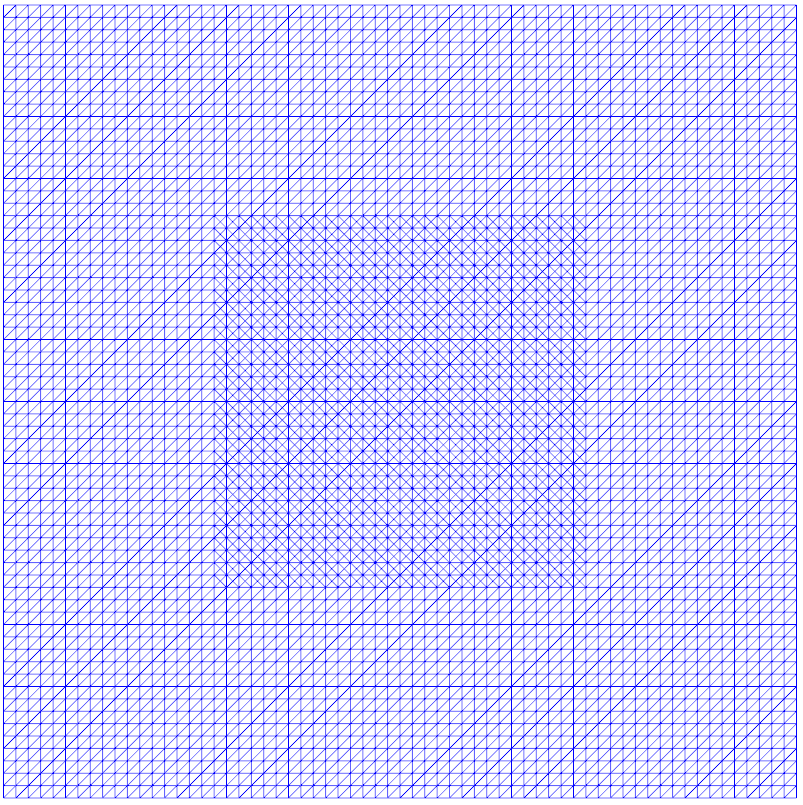

..  #!/usr/bin/env python
  # -*- coding: utf-8 -*-
  
.. py:currentmodule:: dolfin_adjoint

Optimal control of the Poisson equation
=======================================

.. sectionauthor:: Simon W. Funke <simon@simula.no>

This demo solves the `mother problem` of PDE-constrained
optimisation: the optimal control of the Poisson equation.
Physically, this problem can the interpreted as finding the best
heating/cooling of a cooktop to achieve a desired temperature
profile.

This example introduces the basics of how to solve optimisation
problems with dolfin-adjoint.

Problem definition
******************

Mathematically, the problem is to minimise the following tracking-type
functional

.. math::
      \frac{1}{2} \int_{\Omega} (u - d)^2 \textrm{d}x
              + \frac{\alpha}{2} \int_{\Omega} f^2 \textrm{d}s

subject to the Poisson equation with Dirichlet boundary conditions

.. math::
      -\kappa \Delta u &= f  \qquad \mathrm{in} \ \Omega           \\
                        u &= 0  \qquad \mathrm{on} \ \partial \Omega  \\
                        a & \le f \le b

where :math:`\Omega` is the domain of interest (here the unit square),
:math:`u: \Omega \to \mathbb R` is the unkown temperature, :math:`\kappa
\in \mathbb R` is the thermal diffusivity (here: :math:`\kappa = 1`),
:math:`f: \Omega \to \mathbb R` is the unknown control function acting
as source term (:math:`f(x) > 0` corresponds to heating and
:math:`f(x) < 0` corresponds to cooling), :math:`d: \Omega \to \mathbb
R` is the given desired temperature profile, :math:`\alpha \in [0,
\infty)` is a Tikhonov regularisation parameter, and :math:`a, b:
\Omega \to \mathbb R` are lower and upper bounds for the control
function.

It can be shown that this problem is well-posed and has a unique
solution, see :cite:`troltzsch2010` or section 1.5 of
:cite:`hinze2009`.

Implementation
**************

We start our implementation by importing the :py:mod:`dolfin` and
:py:mod:`dolfin_adjoint` modules:

::

  from dolfin import *
  
  from dolfin_adjoint import *
  
Next we import the Python interface to Moola. Moola is a collection
of optimisation solvers specifically designed for PDE-constrained
optimisation problems. If Moola is not yet available on your system,
it is :doc:`easy to install <../../download/index>`.

::

  import moola
  
Next we create a regular mesh of the unit square. Some optimisation
algorithms suffer from bad performance when the mesh is non-uniform
(i.e. when the mesh is partially refined). To demonstrate that Moola
does not have this issue, we refine the mesh near the center of the
domain:

::

  n = 64
  mesh = UnitSquareMesh(n, n)
  
  cf = MeshFunction("bool", mesh, mesh.geometric_dimension())
  subdomain = CompiledSubDomain('std::abs(x[0]-0.5) < 0.25 && std::abs(x[1]-0.5) < 0.25')
  subdomain.mark(cf, True)
  mesh = refine(mesh, cf)
  
The resulting mesh looks like this:

Then we define the discrete function spaces and create functions for
the temperature and the control function.

::

  V = FunctionSpace(mesh, "CG", 1)
  W = FunctionSpace(mesh, "DG", 0)
  
  f = interpolate(Expression("x[0]+x[1]", name='Control', degree=1), W)
  u = Function(V, name='State')
  v = TestFunction(V)
  
The optimisation algorithm will use the value of the control
function :math:`f` as an initial guess for the optimisation.  A
zero-initial guess for the control appears to be too simple: for
example L-BFGS finds the optimal control with just two iterations.
To make it more interesting, we chose a non-zero initial guess
instead.

Next we define the weak formulation of the Poisson problem and solve
it.

::

  F = (inner(grad(u), grad(v)) - f * v) * dx
  bc = DirichletBC(V, 0.0, "on_boundary")
  solve(F == 0, u, bc)
  
By doing so, `dolfin-adjoint` automatically records the details of
each PDE solve (also called a tape). This tape will be used by the
optimisation algorithm to repeatedly solve the forward and adjoint
problems for varying control inputs.

Before we can start the optimisation, we need to specify the control
variable and define the functional of interest.  For this example we
use :math:`d(x, y) = \frac{1}{2\pi^2}\sin(\pi x)\sin(\pi y)` as the
desired temperature profile, and choose :math:`f` as the control
variable.

::

  x = SpatialCoordinate(mesh)
  w = Expression("sin(pi*x[0])*sin(pi*x[1])", degree=3)
  d = 1 / (2 * pi ** 2)
  d = Expression("d*w", d=d, w=w, degree=3)
  
  alpha = Constant(1e-6)
  J = assemble((0.5 * inner(u - d, u - d)) * dx + alpha / 2 * f ** 2 * dx)
  control = Control(f)
  
The next step is to formulate the so-called reduced optimisation
problem. The idea is that the solution :math:`u` can be considered
as a function of :math:`f`: given a value for :math:`f`, we can
solve the Poisson equation to obtain the associated solution
:math:`u`. By denoting this solution function as :math:`u(f)`, we
can write the original optimisation problem as a reduced problem:

.. math::
      \min_f \frac{1}{2} \int_{\Omega} (u(f) - d)^2 \textrm{d}x + \frac{\alpha}{2} \int_{\Omega} f^2 \textrm{d}s

Note that no PDE-constraint is required anymore, since it is
implicitly contained in the solution function.

`dolfin-adjoint` can automatically reduce the optimisation problem
by creating a :py:class:`ReducedFunctional` object.  This object
solves the forward PDE using dolfin-adjoint's tape each time the
functional is to be evaluated, and derives and solves the adjoint
equation each time the functional gradient is to be evaluated.

::

  rf = ReducedFunctional(J, control)
  
Now that all the ingredients are in place, we can perform the
optimisation.

Next we use :py:class:`MoolaOptimizationProblem` to generate a problem that
is compatible with the Moola optimisation framework.  Then, we
wrap the control function into a Moola object, and create a
:py:meth:`NewtonCG` solver for solving the optimisation problem:

::

  problem = MoolaOptimizationProblem(rf)
  f_moola = moola.DolfinPrimalVector(f)
  solver = moola.NewtonCG(problem, f_moola, options={'gtol': 1e-9,
                                                     'maxiter': 20,
                                                     'display': 3,
                                                     'ncg_hesstol': 0})
  
Alternatively an L-BFGS solver could initialised by:

.. code-block:: python

   solver = moola.BFGS(problem, f_moola, options={'jtol': 0,
                                                  'gtol': 1e-9,
                                                  'Hinit': "default",
                                                  'maxiter': 100,
                                                  'mem_lim': 10})

Then we can solve the optimisation problem, extract the optimal
control and plot it:

::

  sol = solver.solve()
  f_opt = sol['control'].data
  
  plot(f_opt, title="f_opt")
  
  # Define the expressions of the analytical solution
  f_analytic = Expression("1/(1+alpha*4*pow(pi, 4))*w", w=w, alpha=alpha, degree=3)
  u_analytic = Expression("1/(2*pow(pi, 2))*f", f=f_analytic, degree=3)
  
We can then compute the errors between numerical and analytical
solutions.

::

  f.assign(f_opt)
  solve(F == 0, u, bc)
  control_error = errornorm(f_analytic, f_opt)
  state_error = errornorm(u_analytic, u)
  print("h(min):           %e." % mesh.hmin())
  print("Error in state:   %e." % state_error)
  print("Error in control: %e." % control_error)
  
The example code can be found in ``examples/poisson-mother`` in the
``dolfin-adjoint`` source tree, and executed as follows:

.. code-block:: bash

  $ python poisson-mother.py
  ...

Convergence order and mesh independence
***************************************

It is highly desirable that the optimisation algorithm achieve mesh
independence: i.e., that the required number of optimisation
iterations is independent of the mesh resolution.  Achieving mesh
independence requires paying careful attention to the inner product
structure of the function space in which the solution is sought.

For our desired temperature, the analytical solutions of the optimisation
problem is:

.. math::
    f_{\textrm{analytic}} &= \frac{1}{1+4\alpha \pi^4}\sin(\pi x) \sin(\pi y) \\
    u_{\textrm{analytic}} &= \frac{1}{2\pi^2}f_{\textrm{analytic}}

The following numerical experiments solve the optimisation problem
for a sequence of meshes with increasing resolutions and record the
numerical error and the required number of optimisation iterations.
A regularisation coefficient of :math:`\alpha = 10^{-6}` was used, and
the optimisation was stopped when the :math:`L_2` norm of the
reduced functional gradient dropped below :math:`10^{-9}`.

Moola Newton-CG
---------------

The Moola Newton-CG algorithm implements an inexact Newton method.
Hence, even though the optimality system of our problem is linear,
we can not expect the algorithm to converge in a single iteration
(however, we could it enforce that by explicitly setting the
relative tolerance of the CG algorithm to zero).

Running the Newton-CG algorithm for the different meshes yielded:

===================  =================  ============== ================
  Mesh element size  Newton iterations  CG iterations  Error in control
===================  =================  ============== ================
  6.250e-02            3                 54            3.83e-02
  3.125e-02            3                 59            1.69e-02
  1.563e-02            3                 57            8.05e-03
  7.813e-03            3                 58            3.97e-03
===================  =================  ============== ================

Here CG iterations denotes the total number of CG iterations during
the optimisation. Mesh independent convergence can be observed, both
in the Newton and CG iterations.

From our choice of discretisation (:math:`DG_0` for :math:`f`), we
expect a 1st order of convergence for the control variable.  Indeed,
the error column in the numerical experiments confirm that this rate
is obtained in practice.

Moola L-BFGS
------------

The L-BFGS algorithm in Moola implements the limited memory quasi
Newton method with Broyden-Fletcher-Goldfarb-Shanno updates.  For
the numerical experiments, the set of the memory history was set to
10.

The numerical results yield:

===================  ==================  =================
  Mesh element size  L-BFGS iterations   Error in control
===================  ==================  =================
  6.250e-02             53                3.83e-02
  3.125e-02             50                1.69e-02
  1.563e-02             57                8.05e-03
  7.813e-03             56                3.97e-03
===================  ==================  =================

Again a mesh-independent convergence and a 1st order convergence of
the control can be observed.

.. bibliography:: /documentation/poisson-mother/poisson-mother.bib
   :cited:
   :labelprefix: 1E-
   :keyprefix: 1E-
