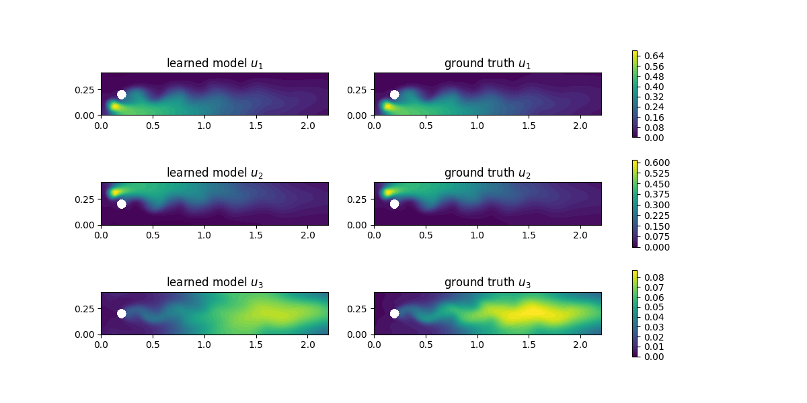
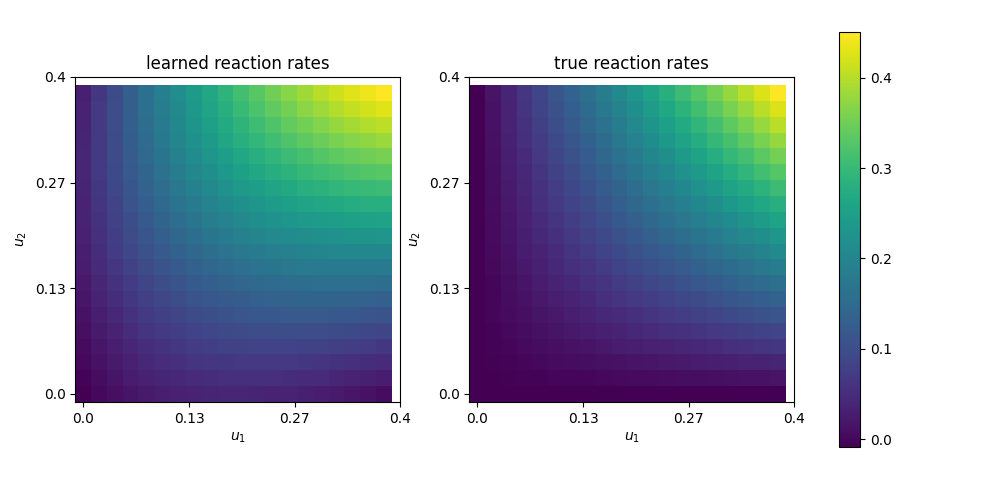

..  #!/usr/bin/env python
  # -*- coding: utf-8 -*-
  
.. py:currentmodule:: dolfin_adjoint

Learning Reaction Rates of an Advection-Diffusion-Reaction System
=================================================================

.. sectionauthor:: Marius Causemann <mariusca@simula.no>

In this demo we try to learn the chemical  reaction rates of an
advection-diffusion-reaction system from data. It is based on
the `advection-diffusion-reaction example <https://fenicsproject.org/pub/tutorial/html/._ftut1010.html#ftut1:reactionsystem>`_
in the FEniCS tutorial 
and uses a feed-forward neural network defined in the UFL language 
to model the reaction rate. Instead of relying on UFL,  it also possible to
coupling dolfin-adjoint with a machine learning framework such as Pytorch for 
more complex architectures (see e.g. :cite:`bm`, https://github.com/barkm/grey-box).

.. figure:: reaction_system.png
  :scale: 60
  :align: center

The system consists of three different chemical species A, B and C,
that are advected by an underlying velocity field :math:`w`, diffuse through
the domain :math:`\Omega` with diffusivity :math:`\epsilon` and obey the following
reaction scheme:

.. math::
  A + B \rightarrow C

With the unknown reaction rate:

.. math::
   \frac{d}{dt}[C] = R([A], [B])

We denote the concentrations of A, B and C with :math:`u_1`, :math:`u_2` and
:math:`u_3` and add source terms :math:`f_1`, :math:`f_2` and
:math:`f_3` for each species, respectively. 
Then the coupled system of nonlinear PDEs reads:

.. math::
  \begin{aligned}
  \frac{\partial u_1}{\partial t} +
    w \cdot \nabla u_1 - \nabla\cdot(\epsilon\nabla u_1)
    &= f_1 - R(u_1, u_2) \\ 
    \frac{\partial u_2}{\partial t} +
    w \cdot \nabla u_2 - \nabla\cdot(\epsilon\nabla u_2)
    &= f_2 - R(u_1, u_2) \\ 
    \frac{\partial u_3}{\partial t} +
    w \cdot \nabla u_3 - \nabla\cdot(\epsilon\nabla u_3)
    &= f_3 + R(u_1, u_2)
    \end{aligned} 

Now, we model the unkown reaction rate :math:`R` with a neural network (NN)
:math:`R_{\theta}(u_1, u_2)` parameterized with the weights :math:`\theta` and
formulate the resulting hybrid PDE-NN problem as a PDE-constrained
optimization problem as introduced in :cite:`mitusch2021hybrid`.

Problem Definition
******************
Assuming that we can observe the concentrations :math:`u_i^{\star}` of all
species i at all points in time in the whole domain, we set the goal to
minimize the weighted :math:`L^2` error:

.. math::
   \begin{aligned}
   \min_{\theta} \sum_{i=1,2,3} \lambda_i \int_0^T \int_{\Omega} (u_i^{\star}(x,t) - u_i^{}(x,t))^2 dxdt \\
   \end{aligned}

subject to:

.. math::
   \begin{aligned}
   \frac{\partial u_1}{\partial t} +
   w \cdot \nabla u_1 - \nabla\cdot(\epsilon\nabla u_1)
   &= f_1 - R_{\theta}(u_1, u_2)  &\text{ in } \Omega \times (0,T) \\ 
   \frac{\partial u_2}{\partial t} +
   w \cdot \nabla u_2 - \nabla\cdot(\epsilon\nabla u_2)
   &= f_2 - R_{\theta}(u_1, u_2)  &\text{ in } \Omega \times (0,T) \\ 
   \frac{\partial u_3}{\partial t} + w \cdot \nabla u_3 - \nabla\cdot(\epsilon\nabla u_3)
   &= f_3 + R_{\theta}(u_1, u_2) &\text{ in } \Omega \times (0,T) \\
   \frac{\partial u_i}{\partial n} &= 0 &\text{ on } \partial\Omega \times (0,T) \\ 
   \end{aligned} 

with initial conditions :math:`u_i=0` for :math:`i=1,2,3`. The weights :math:`\lambda_i`
of the minimization functional are introduced to account for the smaller magnitude
of the concentration of the newly formed species C.

FEniCS implementation
*********************

For the details of the implementation of the background velocity field and
the advection-diffusion-reaction system, we refer to
the `FEniCS tutorial <https://fenicsproject.org/pub/tutorial/html/._ftut1010.html#ftut1:reactionsystem>`_.
Here, we implement a function `solve_reaction_system` 
that solves the reaction system for a given reaction funtion (`reaction_func`)
and computes the loss for each time step, if a loss function (`loss_func`) is provided:

::

  from fenics import *
  set_log_level(50)
  
  def solve_reaction_system(mesh, T, num_steps, reaction_func, loss_func=lambda n,x: 0):
  
      dt = T / num_steps # time step size
      eps = 0.01         # diffusion coefficient
  
      # Define function space for velocity
      W = VectorFunctionSpace(mesh, 'CG', 2)
  
      # Define function space for system of concentrations
      P1 = FiniteElement('CG', triangle, 1)
      element = MixedElement([P1, P1, P1])
      V = FunctionSpace(mesh, element)
  
      # Define test functions
      v_1, v_2, v_3 = TestFunctions(V)
  
      # Define functions for velocity and concentrations
      w = Function(W)
      u = Function(V)
      u_n = Function(V)
  
      # Split system functions to access components
      u_1, u_2, u_3 = split(u)
      u_n1, u_n2, u_n3 = split(u_n)
  
      # Define source terms
      f_1 = Expression('pow(x[0]-0.1,2)+pow(x[1]-0.1,2)<0.05*0.05 ? 10 : 0',
                       degree=1)
      f_2 = Expression('pow(x[0]-0.1,2)+pow(x[1]-0.3,2)<0.05*0.05 ? 10 : 0',
                       degree=1)
      f_3 = Constant(0)
  
      # Define expressions used in variational forms
      k = Constant(dt)
      eps = Constant(eps)
  
      # Define variational problem
      F = (((u_1 - u_n1) / k)*v_1*dx + dot(w, grad(u_1))*v_1*dx 
        + eps*dot(grad(u_1), grad(v_1))*dx + reaction_func(u_1, u_2)*v_1*dx  
        + ((u_2 - u_n2) / k)*v_2*dx + dot(w, grad(u_2))*v_2*dx 
        + eps*dot(grad(u_2), grad(v_2))*dx + reaction_func(u_1, u_2)*v_2*dx  
        + ((u_3 - u_n3) / k)*v_3*dx + dot(w, grad(u_3))*v_3*dx 
        + eps*dot(grad(u_3), grad(v_3))*dx - reaction_func(u_1, u_2)*v_3*dx 
        - f_1*v_1*dx - f_2*v_2*dx - f_3*v_3*dx)
  
      # Create time series for reading velocity data
      timeseries_w = TimeSeries('navier_stokes_cylinder/velocity_series')
      timeseries_w.retrieve(w.vector(), 2.0)
  
      # Time-stepping
      t = 0
      results = []
      loss = 0.0
      for n in range(num_steps):
  
          # Update current time
          t += dt
  
          # Solve variational problem for time step
          solve(F == 0, u)
  
          # Save solution to file (VTK)
          _u_1, _u_2, _u_3 = u.split()
          _u_1.rename("u1","u1")
          _u_2.rename("u2","u3")
          _u_3.rename("u3","u3")
  
          # Update previous solution
          u_n.assign(u)
          loss += loss_func(n, u.split())
          results.append(u.copy())
  
      return loss, results
  
For the NN part, we rely on the 
`NN implementation <https://github.com/sebastkm/hybrid-fem-nn/blob/master/neural_network.py>`_
by :cite:`mitusch2021hybrid`.

Putting those two components together, we can define the hybrid PDE-NN
training problem in a few lines of code. First, we generate the ground
truth training data with the reaction rate :math:`R(u_1, u_2)= K u_1 u_2`:

::

  from neural_network import *
  import numpy as np
  import matplotlib.pyplot as plt
  
  np.random.seed(99)
  
  T = 2.0
  num_steps = 20
  K = Constant(10) 
  
  mesh = Mesh('navier_stokes_cylinder/cylinder.xml.gz')
  
  #ground truth reaction term
  def R_true(u1, u2):
          return K*u1*u2
  
  #create ground_truth data
  _, ground_truth = solve_reaction_system(mesh, T, num_steps, R_true)
  
Next, we define a neural network with one hidden layer with 10 neurons,
two scalar input values and a single scalar output:

::

  layers = [2, 10, 1]
  bias = [True , True]
  net = ANN(layers, bias=bias, mesh=mesh)
  
  def R_net(u1, u2):
      return net([u1, u2])
  
Now, we specify the loss function and compute the loss with the initial weights of the NN:

::

  #define L2 loss function for each timestep i.
  #As the concentrations of u_3 are much smaller, we put more weight on it.
  loss_weights = [1,1, 200]
  
  def loss_func(n, data):
      loss = 0.0
      for u in [0,1,2]:
          loss += loss_weights[u]*assemble((data[u] - ground_truth[n][u])**2*dx)
      return loss
  
  # solve reaction system and compute loss with initial weights
  loss, learned_data = solve_reaction_system(mesh,T, num_steps, R_net,
                                             loss_func=loss_func)
  
Then, we start the training process using the scipy L-BFGS-optimizer for 100 iterations.
Note that the training process can take a significant amout of time,
since at least one solve of the forward and adjoint equation is required
per training iteration.

::

  #define reduced functional
  J_hat = ReducedFunctional(loss, net.weights_ctrls())
  
  #Use scipy L - BFGS optimiser
  opt_weights = minimize(J_hat, method ="L-BFGS-B", tol = 1e-6,
                         options = {'disp': True, "maxiter":100})
  net.set_weights(opt_weights)
  
For evaluation, we compute the concentrations with the learned reaction rates
at final time and observe a good agreement:

::

  # compute final learned state
  final_loss, learned_data = solve_reaction_system(mesh,T, num_steps, R_net,
                                                   loss_func=loss_func)
  
  # plot concentrations at final time
  i = num_steps - 1
  fig, axs = plt.subplots(nrows=3, ncols=2, figsize=(12,6))
  
  for u in [0,1,2]:
      u_max = ground_truth[i].split(deepcopy=True)[u].vector()[:].max()
      plt.axes(axs[u,0])
      plt.title(f"learned model $u_{u+1}$")
      plot(learned_data[i][u], vmin=0, vmax=u_max)
      plt.axes(axs[u,1])
      plt.title(f"ground truth $u_{u+1}$")
      im = plot(ground_truth[i][u], vmin=0, vmax=u_max)
      cbar = fig.colorbar(im, ax=axs[u,:], shrink=0.95)
  
  plt.savefig("concentrations.png")
  

Finally, we are also interested in the learned reaction rates:

::

  # plot learned reaction rates
  n = 20
  c_max = 0.4
  n_ticks = 4
  ticks = np.round(np.linspace(0,c_max, n_ticks),2)
  learned_rates = np.zeros(shape=(n,n))
  exact_rates = np.zeros(shape=(n,n))
  concentrations = np.linspace(0,c_max, n)
  
  for i,c1 in enumerate(concentrations):
      for j,c2 in enumerate(concentrations):
          learned_rates[i,j] = net([Constant(c1), Constant(c2)])([0.0,0.0])
          exact_rates[i,j] = c1*c2*K.values()[0]
  
  vmax = max([learned_rates.max()])#, exact_rates.max()])
  fig, axs = plt.subplots(1,2, figsize = (10,5))
  plt.axes(axs[0])
  plt.title("learned reaction rates")
  im = plt.imshow(learned_rates, origin="lower",vmax=vmax)
  plt.xticks( np.linspace(0,n, n_ticks), ticks)
  plt.yticks( np.linspace(0,n, n_ticks), ticks)
  plt.xlabel("$u_1$")
  plt.ylabel("$u_2$")
  
  plt.axes(axs[1])
  plt.title("true reaction rates")
  plt.imshow(exact_rates, origin="lower")
  plt.xticks( np.linspace(0,n, n_ticks), ticks)
  plt.yticks( np.linspace(0,n, n_ticks), ticks)
  plt.xlabel("$u_1$")
  plt.ylabel("$u_2$")
  
  plt.tight_layout()
  cbar = fig.colorbar(im, ax=axs, shrink=0.95)
  
  plt.savefig("learned_reaction_rates.png")
  

.. bibliography:: /documentation/reaction-rate-learning/reaction-rate-learning.bib
   :cited:

