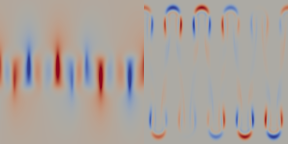

..  #!/usr/bin/env python
  # -*- coding: utf-8 -*-

:orphan:

.. _salt-fingering-example:

.. py:currentmodule:: dolfin_adjoint

Generalised stability analysis of double-diffusive salt fingering
=================================================================

.. sectionauthor:: Patrick E. Farrell <patrick.farrell@maths.ox.ac.uk>

This demo solves example 4.2 of :cite:`farrell2012c`.

Background
**********

In the ocean, the diffusivity coefficient of temperature is approximately two
orders of magnitude larger than the diffusivity coefficient of salinity.
Suppose warm salty water lies above colder, less salty water. If a parcel of
warm salty water sinks downwards into the colder region, the heat of the
parcel will diffuse away much faster than its salt, thus making the parcel
denser, and causing it to sink further. Similarly, if a parcel of cold, less
salty water rises into the warmer region, it will gain heat from its
surroundings much faster than it will gain salinity, making the parcel more
buoyant. This phenomenon is referred to as ''salt fingering''
:cite:`stern1960` and has been observed in many real-world oceanographic
contexts :cite:`turner1985`.

Ozgokmen and Esenkov :cite:`ozgokmen1998b` used a numerical model to
investigate asymmetry in the growth of salt fingers caused by nonlinearities
in the equation of state. In this work, we investigate the stability of the
proposed configuration to small perturbations. Generalised stability theory
is an extension of asymptotic linear stability theory to finite time horizons,
and requires computing the singular value decomposition of the model
*propagator*, whose action requires the solution of the tangent linear and
adjoint models.

Problem definition
******************

The equations describing the system are the two-dimensional
vorticity-streamfunction formulation of the time-dependent Navier--Stokes
equations, coupled to two advection equations for temperature and salinity:

.. math::
           \frac{\partial \zeta}{\partial t} + \nabla^{\perp} \psi \cdot \nabla \zeta &= \frac{\textrm{Ra}}{\textrm{Pr}}\left(\frac{\partial T}{\partial x} - \frac{1}{R_{\rho}^0} \frac{\partial S}{\partial x}\right) + \nabla^2 \zeta, \\
           \frac{\partial T}{\partial t} + \nabla^{\perp} \psi \cdot \nabla T &= \frac{1}{\textrm{Pr}} \nabla^2 T, \\
           \frac{\partial S}{\partial t} + \nabla^{\perp} \psi \cdot \nabla S &= \frac{1}{\textrm{Sc}} \nabla^2 S, \\
           \nabla^2 \psi &= \zeta,

where :math:`\zeta` is the vorticity, :math:`\psi` is the streamfunction,
:math:`T` is the temperature, :math:`S` is the salinity, and :math:`\textrm{Ra}`,
:math:`\textrm{Sc}`, :math:`\textrm{Pr}` and :math:`{R_{\rho}^0}` are nondimensional parameters.
Periodic boundary conditions are applied on the left and right boundaries.
The configuration consists of two well-mixed layers (i.e., of homogeneous
temperature and salinity) separated by an interface. To activate the
instability, :cite:`ozgokmen1998b` add a sinusoidal perturbation to the initial
salinity field.

Implementation
**************

We start our implementation by importing the :py:mod:`dolfin` and
:py:mod:`dolfin_adjoint` modules

::

  from __future__ import print_function
  from fenics import *
  from fenics_adjoint import *
  
Next we create a 50 x 50 regular mesh of the rectangle :math:`[0, 1] \times
[0, 2]`.  This mesh is quite coarse so that the demo runs in approximately ten
minutes; for production computations, this might be run at 300 x 300 or 500 x
500.

::

  mesh = RectangleMesh(Point(0, 0), Point(1, 2), 50, 50)
  
Computing the singular value decomposition of the propagator requires many
actions of the propagator, the operator that maps perturbations in the input
to perturbations in the output at some finite time later.  (The propagator is
typically dense, and so the SVD is computed matrix-free.) Each action requires
the solution of the tangent linear and adjoint systems. Since the same
equations are solved over and over for each action, dolfin-adjoint can
optionally cache the LU factorizations to greatly speed up subsequent
propagator actions.

::

  #parameters["adjoint"]["cache_factorizations"] = True
  
Here we enforce the periodic boundary conditions that map the right-hand
boundary to the left-hand boundary. The :py:func:`inside` function indicates
which boundary is to be mapped *to* (here the left); the :py:func:`map`
function maps from the right-hand boundary to the left-hand boundary.

::

  class PeriodicBoundary(SubDomain):
      def inside(self, x, on_boundary):
          return x[0] == 0.0 and on_boundary
  
      def map(self, x, y):
          y[0] = x[0] - 1
          y[1] = x[1]
  
  pbc = PeriodicBoundary()
  
Now we declare our function spaces. Since the vorticity-streamfunction
formulation no longer has a divergence constraint, we can use piecewise linear
Galerkin finite elements for every prognostic field, without concern for
inf-sup stability conditions.

::

  Vh = FiniteElement("CG", mesh.ufl_cell(), 1)
  Ph = FiniteElement("CG", mesh.ufl_cell(), 1)
  Th = FiniteElement("CG", mesh.ufl_cell(), 1)
  Sh = FiniteElement("CG", mesh.ufl_cell(), 1)
  
  Z = FunctionSpace(mesh, MixedElement((Vh, Ph, Th, Sh)), constrained_domain=pbc) 
  V, P, T, S = Z.split()
  V, P, T, S = V.collapse(), P.collapse(), T.collapse(), S.collapse()
  
We impose that the streamfunction is zero on the top and bottom.

::

  streamfunction_bc_top = DirichletBC(Z.sub(1), 0.0, "on_boundary && near(x[1], 2.0)")
  streamfunction_bc_bot = DirichletBC(Z.sub(1), 0.0, "on_boundary && near(x[1], 0.0)")
  bcs = [streamfunction_bc_top, streamfunction_bc_bot]
  
Set parameters for the timestepping (implicit midpoint) and
values of the nondimensional parameters.

::

  dt = Constant(0.001)
  endT = 0.05
  theta = 0.5
  
  Ra = Constant(1*10**6)
  Pr = Constant(7)
  Sc = Constant(700)
  Rrho = Constant(1.8)
  
Now we configure the initial conditions of :cite:`ozgokmen1998b`.
Since we want to investigate the stability of perturbations to
salinity, we will configure the model so that it propagates a
scalar field called "InitialSalinity" to a scalar field called
"FinalSalinity". Therefore the steps involved in setting up the
initial condition are:

1. Project the initial salinity field to the salinity function space
2. Project that field and the initial conditions for vorticity and
   temperature into the mixed function space, while simultaneously
   solving for the streamfunction.

::

  def get_ic():
  
      class InitialSalinity(Expression):
          def eval(self, values, x):
              # salinity initial condition: salty on top, fresh on the bottom, and a wavy
              # interface in between
              if x[1] > 1.1 + 0.016*cos(10*pi*x[0]):
                  values[0] = 1.0
              elif x[1] < 0.9 + 0.016*cos(10*pi*x[0]):
                  values[0] = 0.0
              else:
                  values[0] = 5*(x[1]-0.016*cos(10*pi*x[0])) - 4.5
  
      class InitialTemperature(Expression):
          def eval(self, values, x):
              # temperature initial condition: warm on top, cool on bottom
              if x[1] > 1.1:
                  values[0] = 1.0
              elif x[1] < 0.9:
                  values[0] = 0.0
              else:
                  values[0] = 5*x[1] - 4.5
  
      salinity_ic = interpolate(InitialSalinity(degree=1), S)
      zeta        = Constant(0) # initially at rest
      t           = InitialTemperature(degree=1)
      s           = salinity_ic
  
      z_test = TestFunction(Z)
      (zeta_test, p_test, t_test, s_test) = split(z_test)
  
      z = Function(Z, name="State")
      (zeta_trial, p_trial, t_trial, s_trial) = split(z)
  
      # project zeta, t, s; solve for the streamfunction p
  
      a = (inner(zeta_test, zeta_trial)*dx +
           inner(t_test, t_trial)*dx       +
           inner(s_test, s_trial)*dx       +
           inner(grad(p_test), grad(p_trial))*dx)
      L = (inner(zeta_test, zeta)*dx       +
           inner(t_test, t)*dx             +
           inner(s_test, s)*dx             -
           inner(p_test, zeta)*dx)
      F = a - L
  
      solve(F == 0, z, bcs, solver_parameters={"newton_solver": {"linear_solver": "lu"}})
      return z
  

.. image:: salinity-ic.png
    :scale: 100
    :align: center

Finally, once we have the mixed function state (zeta, p, t, s) at the end of
the run, we need to project out the salinity. dolfin-adjoint considers whole
functions, not parts of mixed function spaces, and hence the final salinity
component must be projected to the salinity space to ensure that the model is
seen as a map from the initial salinity to the final salinity.

::

  def project_salinity(z_final):
      s = project(split(z_final)[-1], S, name="FinalSalinity")
      return s
  
The main loop of the forward model. Compute the initial conditions, advance
the equations forward in time, and then compute the final salinity.

::

  def main():
  
      # This function takes the theta-weighted average of the old
      # and new values at a timestep. This is used in the timestepping
      # later.
  
      def cn(old, new):
          return (1-theta)*old + theta*new
  
      # Define the :math:`\nabla^\perp` operator (the 2D equivalent of
      # the cross product) and advection flux operators.
  
      def grad_perp(field):
          x = grad(field)
          return as_vector([-x[1], x[0]])
  
      def J(test, stream, tracer):
          return -inner(grad(test), tracer*(grad_perp(stream)))*dx
  
      z_old = get_ic()
      (zeta_old, p_old, t_old, s_old) = split(z_old)
  
      store(z_old, time=0.0)
  
      z_test = TestFunction(Z)
      (zeta_test, p_test, t_test, s_test) = split(z_test)
  
      z = Function(Z, name="NextState")
      (zeta, p, t, s) = split(z)
  
      t_cn = cn(t_old, t)
      s_cn = cn(s_old, s)
      zeta_cn = cn(zeta_old, zeta)
  
      time = 0.0
      while time < endT:
          F = (inner((zeta - zeta_old)/dt, zeta_test)*dx
            +  (1-theta)* J(zeta_test, p_old, zeta_old)
            +  (theta)  * J(zeta_test, p, zeta)
            -  Ra*(1.0/Pr) * inner(zeta_test, grad(t_cn)[0] - (1.0/Rrho)*grad(s_cn)[0])*dx
            +  inner(grad(zeta_test), grad(zeta_cn))*dx
            +  inner((t - t_old)/dt, t_test)*dx
            +  (1-theta)* J(t_test, p_old, t_old)
            +  (theta)  * J(t_test, p, t)
            +  (1.0/Pr) * inner(grad(t_test), grad(t_cn))*dx
            +  inner((s - s_old)/dt, s_test)*dx
            +  (1-theta)* J(s_test, p_old, s_old)
            +  (theta)  * J(s_test, p, s)
            +  (1.0/Sc) * inner(grad(s_test), grad(s_cn))*dx
            +  inner(grad(p_test), grad(p))*dx
            +  inner(p_test, zeta)*dx)
  
          solve(F == 0, z, bcs=bcs, J=derivative(F, z), solver_parameters=
          {"newton_solver": {"maximum_iterations": 20, "linear_solver": "mumps"}})
  
          z_old.assign(z)
  
          time += float(dt)
          store(z_old, time=time)
  
      s = project_salinity(z_old)
  
I/O functions for the forward and stability runs.  First, define a function to
perform the I/O during the forward run.  These PVD files store the forward
simulation results for visualisation in paraview.

::

  zeta_pvd = File("results/velocity.pvd")
  p_pvd = File("results/streamfunction.pvd")
  t_pvd = File("results/temperature.pvd")
  s_pvd = File("results/salinity.pvd")
  
  def store(z, time):
      if MPI.rank(mpi_comm_world()) == 0:
          info_blue("Storing variables at t=%s" % time)
  
      (u, p, t, s) = z.split()
  
      u.rename("Velocity", "u")
      p.rename("Pressure", "p")
      t.rename("Temperature", "t")
      s.rename("Salinity", "s")
      zeta_pvd << (u, time)
      p_pvd << (p, time)
      t_pvd << (t, time)
      s_pvd << (s, time)
  
Next, the I/O function for the output of the generalised stability analysis
(gst stands for generalised stability theory).

::

  s_in_pvd = File("results/gst_input_s.pvd")
  s_out_pvd = File("results/gst_output_s.pvd")
  
  def store_gst(z, io, i):
      if io == "input":
          z.rename("SalinityIn%d" % i, "gst_in_%d" % i)
          s_in_pvd << (z, float(i))
  
          filexdmf = XDMFFile(mpi_comm_world(), "results/gst_input_%s.xdmf" % i)
          filexdmf.write(z)
      elif io == "output":
          z.rename("SalinityOut%d" % i, "gst_out_%d" % i)
          s_out_pvd << (z, float(i))
  
          filexdmf = XDMFFile(mpi_comm_world(), "results/gst_output_%s.xdmf" % i)
          filexdmf.write(z)
  
  if __name__ == "__main__":
  # First, run the forward model, building the graph:
  
      z = main()
  
Now take the singular value decomposition of the propagator that maps
perturbations to initial salinity forwards in time to perturbations in final
salinity. This requires that libadjoint was compiled with support for SLEPc:

::

      gst = compute_gst("InitialSalinity", "FinalSalinity", nsv=2)
  
Now fetch the results of the SVD:

::

      for i in range(gst.ncv):
          (sigma, u, v) = gst.get_gst(i, return_vectors=True)
  
          print("Singular value: ", sigma)
  
          store_gst(v, "input", i)
          store_gst(u, "output", i)
  
The example code can be found in ``examples/salt-fingering`` in the ``dolfin-adjoint``
source tree, and executed as follows:

.. code-block:: bash

  $ mpiexec -n 4 python salt-fingering.py
  ...
  1 EPS nconv=2 Values (Errors) 1.13047e+06GST calculation took 17 multiplications of L^*L.
  GST calculation took 17 multiplications of L^*L.
  Singular value:  1063.23627036
  Singular value:  1062.77728405

The fact that the singular values are greater than 1 indicates that the system
is unstable to the perturbations identified.

This image shows the leading initial perturbation and the arising final perturbation.
The perturbation selectively promotes the growth of some fingers, and retards the
growth of others.

.. rubric:: References

.. bibliography:: /documentation/salt-fingering/salt-fingering.bib
   :cited:
   :labelprefix: 6E-
