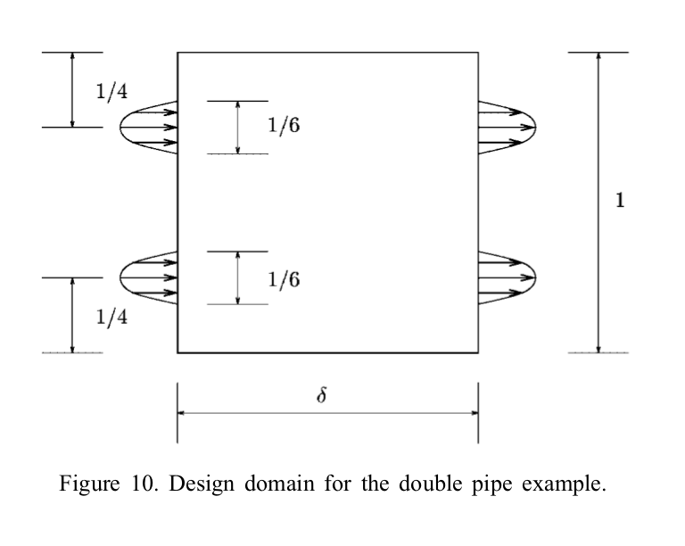
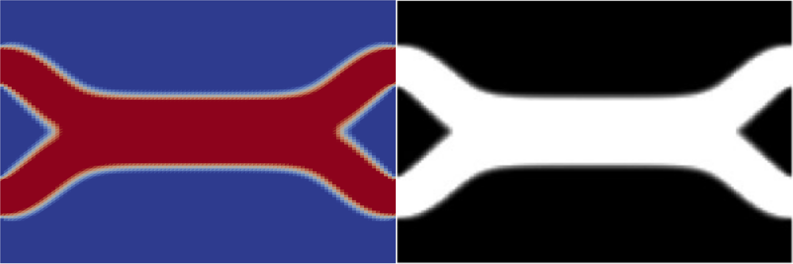

.. py:currentmodule:: dolfin_adjoint

Topology optimisation of fluids in Stokes flow
==============================================

.. sectionauthor:: Patrick E. Farrell <patrick.farrell@maths.ox.ac.uk>

This demo solves example 4 of :cite:`borrvall2003`.

Problem definition
******************

This problem is to minimise the dissipated power in the fluid

.. math::
      \frac{1}{2} \int_{\Omega} \alpha(\rho) u \cdot u + \frac{\mu}{2} \int_{\Omega} \nabla u : \nabla u - \int_{\Omega} f u

subject to the Stokes equations with velocity Dirichlet conditions

.. math::
      \alpha(\rho) u - \mu \nabla^2 u + \nabla p &= f \qquad \mathrm{in} \ \Omega        \\
                                 \mathrm{div}(u) &= 0 \qquad \mathrm{on} \ \Omega        \\
                                               u &= b \qquad \mathrm{on} \ \delta \Omega \\

and to the control constraints on available fluid volume

.. math::
         0 \le \rho(x) &\le 1  \qquad \forall x \in \Omega \\
         \int_{\Omega} \rho &\le V

where :math:`u` is the velocity, :math:`p` is the pressure,
:math:`\rho` is the control (:math:`\rho(x) = 1` means fluid present,
:math:`\rho(x) = 0` means no fluid present), :math:`f` is a prescribed
source term (here 0), :math:`V` is the volume bound on the control,
:math:`\alpha(\rho)` models the inverse permeability as a function of
the control

.. math::
      \alpha(\rho) = \bar{\alpha} + (\underline{\alpha} - \bar{\alpha}) \rho \frac{1 + q}{\rho + q}

with :math:`\bar{\alpha}`, :math:`\underline{\alpha}` and :math:`q`
prescribed constants. The parameter :math:`q` penalises deviations
from the values 0 or 1; the higher q, the closer the solution will be
to having the two discrete values 0 or 1.

The problem domain :math:`\Omega` is parameterised by the aspect ratio
:math:`\delta` (the domain is 1 unit high and :math:`\delta` units
wide); in this example, we will solve the harder problem of
:math:`\delta = 1.5`.  The boundary conditions are specified in figure
10 of Borrvall and Petersson, reproduced here.

Physically, this problem corresponds to finding the fluid-solid
distribution :math:`\rho(x)` that minimises the dissipated power in
the fluid.

As Borrvall and Petersson comment, it is necessary to solve this
problem with :math:`q=0.1` to ensure that the result approaches a
discrete-valued solution, but solving this problem directly with this
value of :math:`q` leads to a local minimum configuration of two
straight pipes across the domain (like the top half of figure 11).
Therefore, we follow their suggestion to first solve the optimisation
problem with a smaller penalty parameter of :math:`q=0.01`; this
optimisation problem does not yield bang-bang solutions but is easier
to solve, and gives an initial guess from which the :math:`q=0.1` case
converges to the better minimum.

Implementation
**************

First, the :py:mod:`dolfin` and :py:mod:`dolfin_adjoint` modules are
imported:

::

  from __future__ import print_function
  from dolfin import *
  from dolfin_adjoint import *
  
Next we import the Python interface to IPOPT. If IPOPT is
unavailable on your system, we strongly :doc:`suggest you install it
<../../download/index>`; IPOPT is a well-established open-source
optimisation algorithm.

::

  try:
      import pyipopt
  except ImportError:
      info_red("""This example depends on IPOPT and pyipopt. \
    When compiling IPOPT, make sure to link against HSL, as it \
    is a necessity for practical problems.""")
      raise
  
  # turn off redundant output in parallel
  parameters["std_out_all_processes"] = False
  
Next we define some constants, and define the inverse permeability as
a function of :math:`\rho`.

::

  mu = Constant(1.0)                   # viscosity
  alphaunderbar = 2.5 * mu / (100**2)  # parameter for \alpha
  alphabar = 2.5 * mu / (0.01**2)      # parameter for \alpha
  q = Constant(0.01) # q value that controls difficulty/discrete-valuedness of solution
  
  def alpha(rho):
      """Inverse permeability as a function of rho, equation (40)"""
      return alphabar + (alphaunderbar - alphabar) * rho * (1 + q) / (rho + q)
  
Next we define the mesh (a rectangle 1 high and :math:`\delta` wide)
and the function spaces to be used for the control :math:`\rho`, the
velocity :math:`u` and the pressure :math:`p`. Here we will use the
Taylor-Hood finite element to discretise the Stokes equations
:cite:`taylor1973`.

::

  N = 200
  delta = 1.5  # The aspect ratio of the domain, 1 high and \delta wide
  V = Constant(1.0/3) * delta  # want the fluid to occupy 1/3 of the domain
  
  mesh = RectangleMesh(mpi_comm_world(), Point(0.0, 0.0), Point(delta, 1.0), N, N)
  A = FunctionSpace(mesh, "CG", 1)        # control function space
  
  U_h = VectorElement("CG", mesh.ufl_cell(), 2)
  P_h = FiniteElement("CG", mesh.ufl_cell(), 1)
  W = FunctionSpace(mesh, U_h*P_h)          # mixed Taylor-Hood function space
  
Define the boundary condition on velocity

::

  class InflowOutflow(Expression):
      def eval(self, values, x):
          values[1] = 0.0
          values[0] = 0.0
          l = 1.0/6.0
          gbar = 1.0
  
          if x[0] == 0.0 or x[0] == delta:
              if (1.0/4 - l/2) < x[1] < (1.0/4 + l/2):
                  t = x[1] - 1.0/4
                  values[0] = gbar*(1 - (2*t/l)**2)
              if (3.0/4 - l/2) < x[1] < (3.0/4 + l/2):
                  t = x[1] - 3.0/4
                  values[0] = gbar*(1 - (2*t/l)**2)
  
      def value_shape(self):
          return (2,)
  
Next we define a function that given a control :math:`\rho` solves the
forward PDE for velocity and pressure :math:`(u, p)`. (The advantage
of formulating it in this manner is that it makes it easy to conduct
:doc:`Taylor remainder convergence tests
<../../documentation/verification>`.)

::

  def forward(rho):
      """Solve the forward problem for a given fluid distribution rho(x)."""
      w = Function(W)
      (u, p) = split(w)
      (v, q) = TestFunctions(W)
  
      F = (alpha(rho) * inner(u, v) * dx + inner(grad(u), grad(v)) * dx +
           inner(grad(p), v) * dx  + inner(div(u), q) * dx)
      bc = DirichletBC(W.sub(0), InflowOutflow(), "on_boundary")
      solve(F == 0, w, bcs=bc)
  
      return w
  
Now we define the ``__main__`` section. We define the initial guess
for the control and use it to solve the forward PDE. In order to
ensure feasibility of the initial control guess, we interpolate the
volume bound; this ensures that the integral constraint and the bound
constraint are satisfied.

::

  if __name__ == "__main__":
      rho = interpolate(Constant(float(V)/delta), A, name="Control")
      w   = forward(rho)
      (u, p) = split(w)
  
With the forward problem solved once, :py:mod:`dolfin_adjoint` has
built a *tape* of the forward model; it will use this tape to drive
the optimisation, by repeatedly solving the forward model and the
adjoint model for varying control inputs.

As in the :doc:`Poisson topology example
<../poisson-topology/poisson-topology>`, we will use an evaluation
callback to dump the control iterates to disk for visualisation. As
this optimisation problem (:math:`q=0.01`) is solved only to generate
an initial guess for the main task (:math:`q=0.1`), we shall save
these iterates in ``output/control_iterations_guess.pvd``.

::

      controls = File("output/control_iterations_guess.pvd")
      allctrls = File("output/allcontrols.pvd")
      rho_viz = Function(A, name="ControlVisualisation")
      def eval_cb(j, rho):
          rho_viz.assign(rho)
          controls << rho_viz
          allctrls << rho_viz
  
Now we define the functional and :doc:`reduced functional
<../maths/2-problem>`:

::

      J = Functional(0.5 * inner(alpha(rho) * u, u) * dx + mu * inner(grad(u), grad(u)) * dx)
      m = Control(rho)
      Jhat = ReducedFunctional(J, m, eval_cb_post=eval_cb)
  
The control constraints are the same as the :doc:`Poisson topology
example <../poisson-topology/poisson-topology>`, and so won't be
discussed again here.

::

      # Bound constraints
      lb = 0.0
      ub = 1.0
  
      # Volume constraints
      class VolumeConstraint(InequalityConstraint):
          """A class that enforces the volume constraint g(a) = V - a*dx >= 0."""
          def __init__(self, V):
              self.V = float(V)
  
The derivative of the constraint g(x) is constant
(it is the negative of the diagonal of the lumped mass matrix for the
control function space), so let's assemble it here once.
This is also useful in rapidly calculating the integral each time
without re-assembling.

::

              self.smass = assemble(TestFunction(A) * Constant(1) * dx)
              self.tmpvec = Function(A)
  
          def function(self, m):
              print("Evaluting constraint residual")
              self.tmpvec.vector()[:] = m
  
              # Compute the integral of the control over the domain
              integral = self.smass.inner(self.tmpvec.vector())
              print("Current control integral: ", integral)
              return [self.V - integral]
  
          def jacobian(self, m):
              print("Computing constraint Jacobian")
              return [-self.smass]
  
          def output_workspace(self):
              return [0.0]
  
Now that all the ingredients are in place, we can perform the initial
optimisation. We set the maximum number of iterations for this initial
optimisation problem to 30; there's no need to solve this to
completion, as its only purpose is to generate an initial guess.

::

      # Solve the optimisation problem with q = 0.01
      problem = MinimizationProblem(Jhat, bounds=(lb, ub), constraints=VolumeConstraint(V))
      parameters = {'maximum_iterations': 20}
  
      solver = IPOPTSolver(problem, parameters=parameters)
      rho_opt = solver.solve()
  
      rho_opt_xdmf = XDMFFile(mpi_comm_world(), "output/control_solution_guess.xdmf")
      rho_opt_xdmf.write(rho_opt)
  
With the optimised value for :math:`q=0.01` in hand, we *reset* the
dolfin-adjoint state, clearing its tape, and configure the new problem
we want to solve. We need to update the values of :math:`q` and
:math:`\rho`:

::

      q.assign(0.1)
      rho.assign(rho_opt)
      adj_reset()
  
Since we have cleared the tape, we need to execute the forward model
once again to redefine the problem. (It is also possible to modify the
tape, but this way is easier to understand.) We will also redefine the
functionals and parameters; this time, the evaluation callback will
save the optimisation iterations to
``output/control_iterations_final.pvd``.

::

      rho_intrm = XDMFFile(mpi_comm_world(), "intermediate-guess-%s.xdmf" % N)
      rho_intrm.write(rho)
  
      w = forward(rho)
      (u, p) = split(w)
  
      # Define the reduced functionals
      controls = File("output/control_iterations_final.pvd")
      rho_viz = Function(A, name="ControlVisualisation")
      def eval_cb(j, rho):
          rho_viz.assign(rho)
          controls << rho_viz
          allctrls << rho_viz
  
      J = Functional(0.5 * inner(alpha(rho) * u, u) * dx + mu * inner(grad(u), grad(u)) * dx)
      m = Control(rho)
      Jhat = ReducedFunctional(J, m, eval_cb_post=eval_cb)
  
We can now solve the optimisation problem with :math:`q=0.1`, starting
from the solution of :math:`q=0.01`:

::

      problem = MinimizationProblem(Jhat, bounds=(lb, ub), constraints=VolumeConstraint(V))
      parameters = {'maximum_iterations': 100}
  
      solver = IPOPTSolver(problem, parameters=parameters)
      rho_opt = solver.solve()
  
      rho_opt_final = XDMFFile(mpi_comm_world(), "output/control_solution_final.xdmf")
      rho_opt_final.write(rho_opt)
  
The example code can be found in ``examples/stokes-topology/`` in the
``dolfin-adjoint`` source tree, and executed as follows:

.. code-block:: bash

  $ mpiexec -n 4 python stokes-topology.py
  ...
  Number of Iterations....: 100

                                     (scaled)                 (unscaled)
  Objective...............:   4.5944633030224409e+01    4.5944633030224409e+01
  Dual infeasibility......:   1.8048641504211900e-03    1.8048641504211900e-03
  Constraint violation....:   0.0000000000000000e+00    0.0000000000000000e+00
  Complementarity.........:   9.6698653740681504e-05    9.6698653740681504e-05
  Overall NLP error.......:   1.8048641504211900e-03    1.8048641504211900e-03

  Number of objective function evaluations             = 105
  Number of objective gradient evaluations             = 101
  Number of equality constraint evaluations            = 0
  Number of inequality constraint evaluations          = 105
  Number of equality constraint Jacobian evaluations   = 0
  Number of inequality constraint Jacobian evaluations = 101
  Number of Lagrangian Hessian evaluations             = 0
  Total CPU secs in IPOPT (w/o function evaluations)   =     11.585
  Total CPU secs in NLP function evaluations           =    556.795

  EXIT: Maximum Number of Iterations Exceeded.

The optimisation iterations can be visualised by opening
``output/control_iterations_final.pvd`` in paraview. The resulting
solution appears very similar to the solution proposed in
:cite:`borrvall2003`.

.. rubric:: References

.. bibliography:: /documentation/stokes-topology/stokes-topology.bib
   :cited:
   :labelprefix: 4E-
